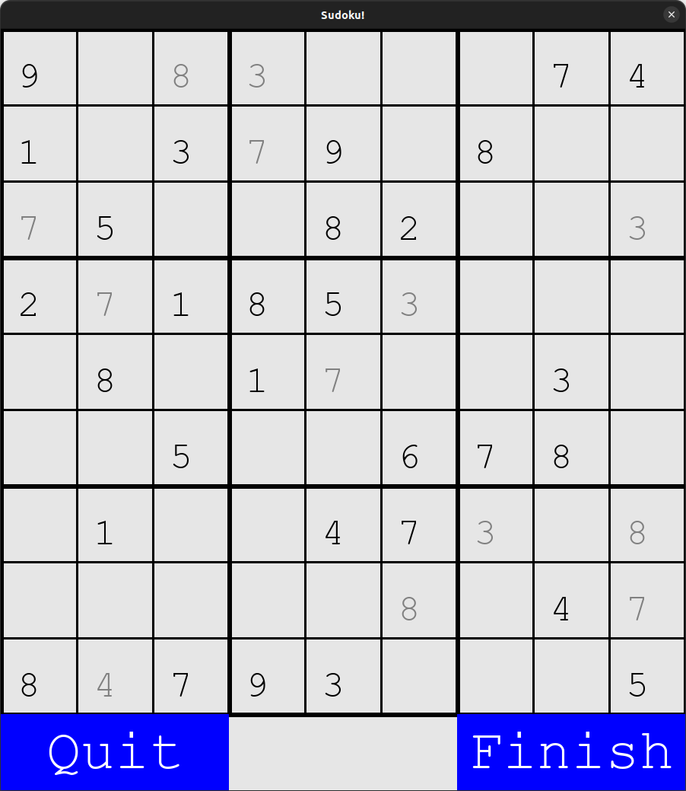

# Sudoku
A sudoku game made in Pygame. I believe I tried to make a Sudoku game, because of Tech With Tim's Pygame Sudoku project.



## Installation
First, have Python 3 in your machine.

Clone this repository:
```
$ git clone git@github.com:GABETROLL/Sudoku.git
$ cd Sudoku/
```

Install Pygame:
```
pip3 install pygame
```
(Or ``pip`` instead of ``pip3`` for Windows)
## Usage
### Running
```
$ python3 main.py
```
Or ``python`` for Windows.
### Controls
To write a number in the board, use your mouse to select the box you wish to fill a number in, then type the digit you want. Then, press ENTER to save the number in the board.

To erase a number, select the box with the number you wish to erase, and press backspace, then press ENTER to save the change to the board.
